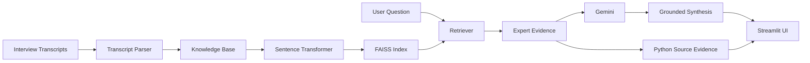

# Hasamex AI Engineer Case Study

## Overview

This Streamlit application analyzes three expert interviews about robotic surgery adoption in France, Germany, and the United Kingdom. It retrieves relevant expert responses and uses Gemini to produce concise qualitative synthesis while Python renders the exact transcript evidence, timestamps, and metadata.

## Features

- Interview Guide Q&A
- Ask Across Calls
- Cross-Call Analysis
- Transcript Explorer
- Source-grounded evidence
- Exact quotes and timestamps
- Expert, role, and market metadata

## Architecture



## Project Structure

```text
data/       Original interview transcripts and guide
src/         Parser, knowledge base, retrieval, Gemini, and analysis modules
tests/       Offline parser and knowledge-base tests
app.py       Streamlit application
```

## Tech Stack

- Python 3.11+
- Streamlit
- Google Gemini via `google-genai`
- Sentence Transformers (`all-MiniLM-L6-v2`)
- FAISS with normalized inner-product search
- python-dotenv

## Setup

```powershell
python -m venv venv
venv\Scripts\activate
python -m pip install -r requirements.txt
```

Create a local `.env` file with:

```text
GEMINI_API_KEY=your_key_here
```

Never commit `.env`. For Streamlit Community Cloud, add `GEMINI_API_KEY` through the app's Secrets settings.

## Run

```powershell
python -m streamlit run app.py
```

## How It Works

1. The parser reads the original UTF-8 transcripts and preserves timestamped records.
2. The knowledge base loads all transcript files programmatically.
3. Only expert responses are embedded for answer retrieval.
4. FAISS returns relevant records with similarity scores.
5. Gemini receives only the retrieved evidence and produces synthesis.
6. Python displays the retrieved records as the authoritative source evidence.

## Source Grounding

Gemini is instructed not to create quotes, timestamps, names, roles, markets, or citations. Exact quotes and metadata shown in the UI come from parsed transcript records returned by Python. If the supplied evidence is insufficient, the application uses `Insufficient evidence in the provided transcripts.`

## Testing

```powershell
python -m pytest -q
python -c "from pathlib import Path; files=[Path('app.py'), *Path('src').glob('*.py')]; [compile(p.read_text(encoding='utf-8'), str(p), 'exec') for p in files]; print('syntax ok')"
```

The offline tests do not require Gemini credentials. Live synthesis requires `GEMINI_API_KEY` and the installed runtime dependencies.

## Design Decisions

- **FAISS:** simple, fast local vector search for the small transcript set.
- **Sentence Transformers:** provides lightweight semantic retrieval without external indexing infrastructure.
- **Gemini:** produces concise qualitative synthesis from retrieved evidence.
- **Streamlit:** enables a clear, demo-ready research workflow.
- **Python-controlled evidence:** prevents the model from inventing source metadata.

## Limitations

- The dataset contains only three interviews.
- Semantic retrieval may return related rather than exact passages.
- Results depend on the evidence retrieved for a question.
- Gemini requires API access for generated synthesis.

## Future Improvements

- Hybrid BM25 and vector retrieval
- Cross-encoder reranking
- Persistent vector storage
- Structured claim-to-evidence objects
- Retrieval and grounding evaluation metrics

## Deployment

Deploy `app.py` to Streamlit Community Cloud with `requirements.txt`, `data/`, and `src/` included. Configure `GEMINI_API_KEY` using Streamlit Secrets; do not commit credentials.
